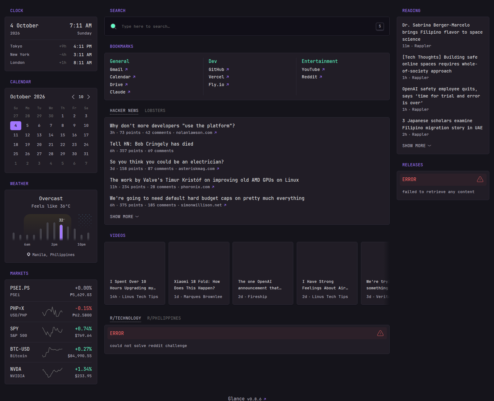

# Aura Start

A personal start page built on [Glance](https://github.com/glanceapp/glance) (pinned to `v0.8.6`),
themed with the colors from the [Aura Chrome theme](https://github.com/daltonmenezes/aura-theme/tree/main/packages/chrome).



## What's in here

| Path | Purpose |
| ---- | ------- |
| `config/glance.yml` | Server, theme (Aura palette) and branding |
| `config/home.yml` | The page layout and widgets |
| `assets/aura.css` | Custom CSS that maps the full Aura Chrome palette onto Glance |
| `Dockerfile` | Official `glanceapp/glance` image with this config baked in |
| `fly.toml` | Fly.io deployment (Singapore region, always on) |
| `docker-compose.yml` | Self-hosting alternative |

## Why not Vercel?

Glance is a long-running Go server with an in-memory cache, and its supported install
methods are Docker and a standalone binary. Vercel only runs short-lived serverless
functions, so instead this deploys the official Docker image to Fly.io, which keeps one
small machine running (roughly $2–3/month).

## Deploy to Fly.io

1. Install the CLI and log in:
   ```sh
   curl -L https://fly.io/install.sh | sh
   fly auth login
   ```
2. Pick a unique app name in `fly.toml` (`app = "..."`), then create the app and deploy:
   ```sh
   fly launch --no-deploy --copy-config   # registers the app, keeps this fly.toml
   fly deploy
   ```
3. Open it: `fly open` (it's served at `https://<app>.fly.dev`).

### Auto-deploy on push (optional)

`.github/workflows/fly-deploy.yml` redeploys on every push to `main`.
Create a token with `fly tokens create deploy` and add it to the repo as the
`FLY_API_TOKEN` Actions secret.

## Run locally / self-host

```sh
docker compose up -d
# http://localhost:8080
```

## Customizing

- **Widgets**: edit `config/home.yml`. See the
  [Glance configuration docs](https://github.com/glanceapp/glance/blob/v0.8.6/docs/configuration.md).
- **Colors**: the theme values in `config/glance.yml` are HSL conversions of the Aura Chrome
  manifest colors, and `assets/aura.css` holds the rest of the palette as `--aura-*` variables.
  Browsers cache the CSS, so press Ctrl+F5 after changing it.
- **Upgrading Glance**: change the tag in `Dockerfile` (and `docker-compose.yml`) and redeploy.
- **GitHub releases widget**: unauthenticated requests are limited to 60/hour. To raise the limit,
  run `fly secrets set GITHUB_TOKEN=...` and add a `token:` line to the releases widget in `config/home.yml` that references it with a dollar sign and braces around `GITHUB_TOKEN`. Only add that line after the secret is set, because Glance refuses to start when a referenced variable is missing.
